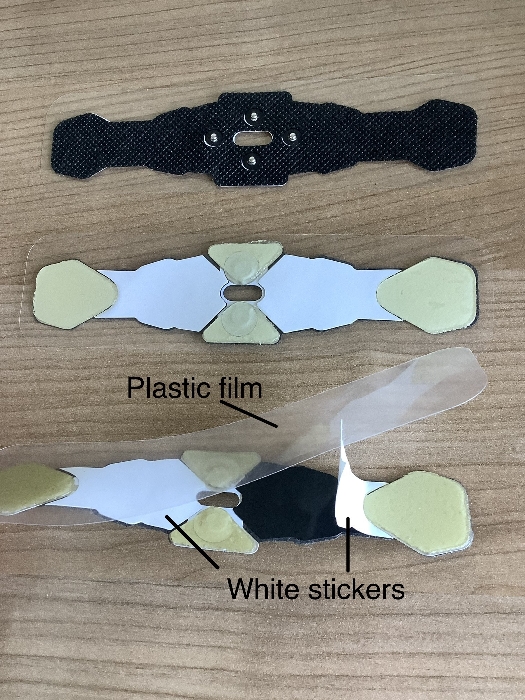

Each patch is designed for **3 uses**, but if you notice the gels losing their stickiness, it's best to **replace the patch** to maintain accurate data collection.  

Steps to change the patch:

1. **Remove the old patch** 

    - Gently pull it off the EEG headband. 

2. **Prepare the new patch** 

    - Take a fresh patch.
    
    - Carefully peel off the plastic film. 
    
    - Carefully peel off the white stickers that cover the areas other than the gels.
    
    - Throw away the white stickers, but keep the film in a safe place — you’ll need it later to protect the gels.  

    

3. **Attach the patch** 

    - Line up the snaps and press them together until you hear **4 distinct clicks**. No need to worry about the direction. 

4. **Double-check the attachment** 

    - Give the patch a **gentle tug** to ensure all four snaps are securely in place. If any snap is loose, reattach it before use.
