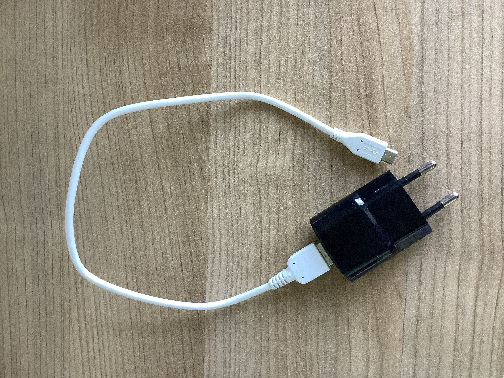

To charge the EEG headband, follow these steps:  

1. **Gather the charging components:**  
   
    - The EEG headband  

    - The charging cable 

    - The charger  

2. **Connect the charging cable:**  
   
    - Locate the charging port at the bottom of the EEG headband.

    - Plug one end of the charging cable into the charging port.  

    - Plug the other end into the charger.  

3. **Plug the charger into a power outlet.**  

4. **Check the charging status:**  
    
    - When charging, the small LED light on the headband will turn **solid white**.  

    
    
    - If there is no light, ensure the connections are secure.  

    

5. **Charging time:**  
   
    - The headband takes approximately **1 hour** to charge from **0% to 100%**.  

6. **When charging is complete:**   
    
    - Unplug the charger and disconnect the charging cable from the headband. 

    

7. **Reset the EEG headband:**
    
    - To reset the EEG headband, follow the instructions in the **help menu**.
    