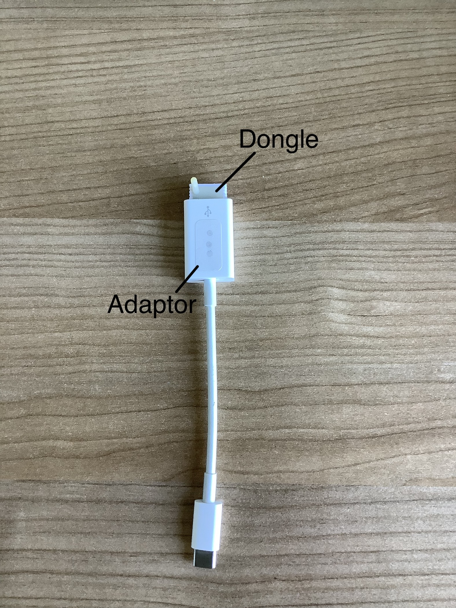
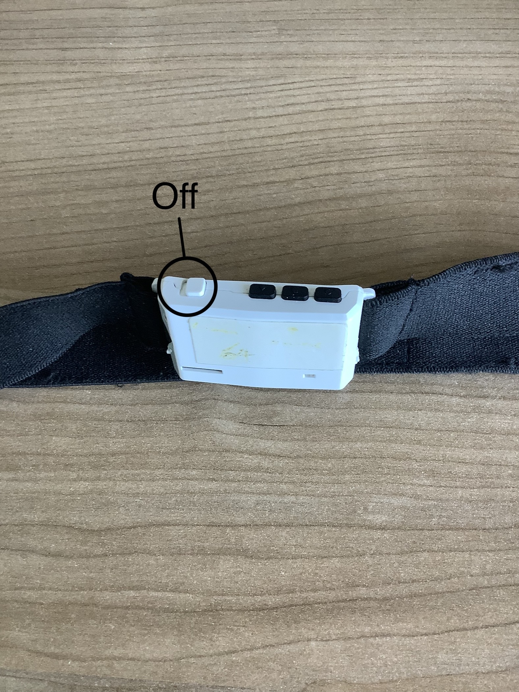
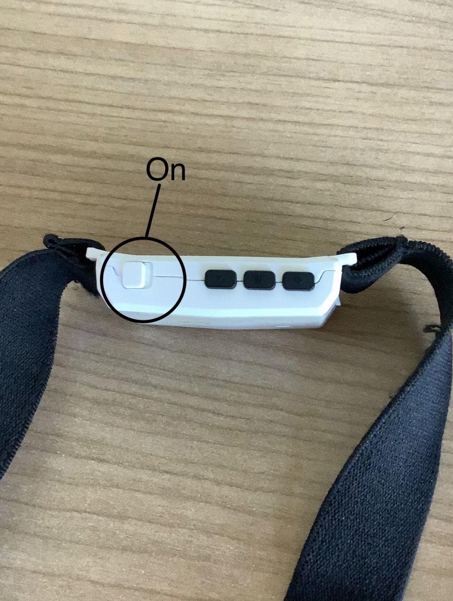
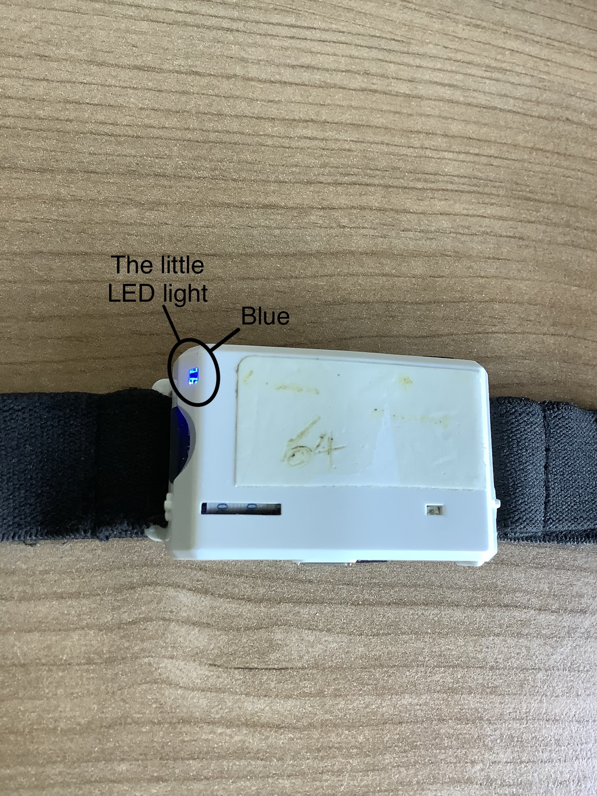
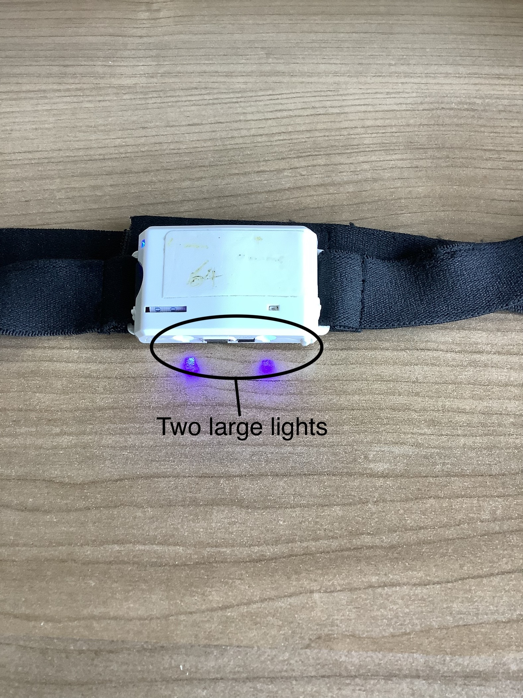

You will need to wear the EEG headband throughout each session and ensure it is connected to the software.

#### 1. EEG Headband Receiver Connection

- The EEG headband communicates with the software through the **EEG headband receiver** – a **dongle** included in your equipment set.

    

- **Plug the dongle into a USB port** on the provided laptop.

#### 2. Turn On the EEG Headband

- Locate the power button at the top of the EEG headband and slide it to the outer side to turn it on.

    

    

- The EEG headband has two types of LED lights:

    - A small LED light on the top left corner at the back that indicates the battery level.

    

    - Two large LED lights at the bottom side for light cueing.

    

- You can check if the EEG headband is on by looking at the **small LED light** and **listening to the sound**.

    - **When the headband is OFF:**
        
        - The small LED light blinks slowly in blue.

        - A single beep sounds when it is turned off.
    
    - **When the headband is ON:**
        
        - The small LED light is solid blue (no blinking).
        
        - Three quick beeps sound.

- If the light does not appear as described above, consult the **help menu** for more information on light indicators.