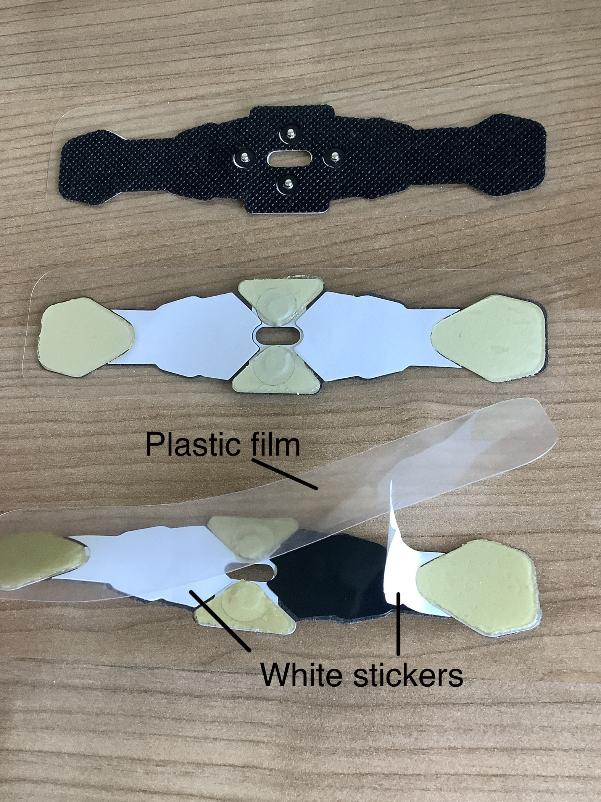

### 1. Clean Your Forehead

- Gently wash your forehead and temples with mild soap and water to remove dirt and dead skin.

- Pat dry with a soft cloth or tissue to ensure your skin is completely dry.

- **Avoid using alcohol-based cleaners** – they can be too harsh on your skin.

### 2. Clean the EEG Patch

### 2.1 If it is not the first use

- Before putting on the EEG headband, clean the patch to maintain gel stickiness.

- Temporarily remove the plastic film and set it aside – at the end of each experimental session, place it back onto the gels to preserve their stickiness.

- Gently wipe the gels with the provided **alcohol pads** and let them dry.

    

- **Do not use dry tissues or cloths** – they can leave lint or residue, reducing gel adhesion.

- Each patch can be used **up to three times**. If the gels lose their stickiness sooner, follow the steps below to change the patch with a new one to ensure optimal data quality.

### 2.2 If it is the first use

- Gently pull the old patch off the EEG headband, and take a fresh patch.

- To apply the fresh patch to the headband, line up the snaps and press them together until you hear **4 distinct clicks**. No need to worry about the direction. 

- Give the patch a **gentle tug** to ensure all four snaps are securely in place. If any snap is loose, reattach it before use.

- Carefully peel off the plastic film.

- Carefully peel off the white stickers that cover the areas other than the gels. 

- You can throw away the white stickers, but make sure to keep the plastic film in a safe place — you’ll need it later to protect the gels. 

    

### 3. Prepare the Laptop

- Place the laptop on a flat, stable surface (such as a nightstand or bedside table) **within arm’s reach** for easy access.

- Ensure the laptop is plugged in.

### 4. Prepare Your Sleep Environment

- Keep your sleep environment consistent with your usual setup – this helps your body relax and settle in.

- Refer to the **help menu** for tips on creating an optimal sleep environment.
